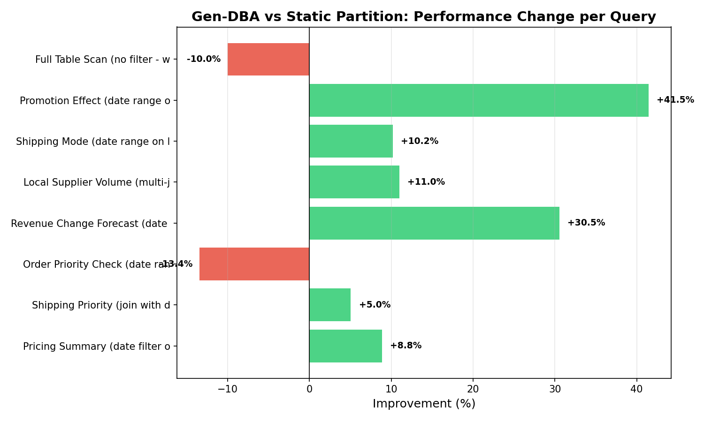
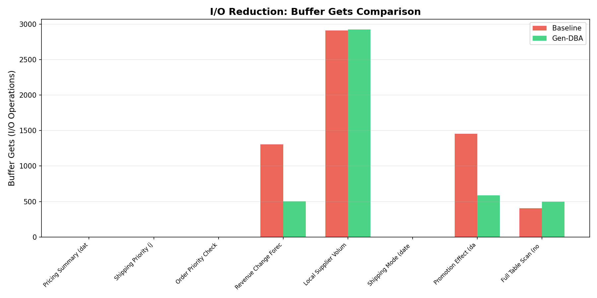
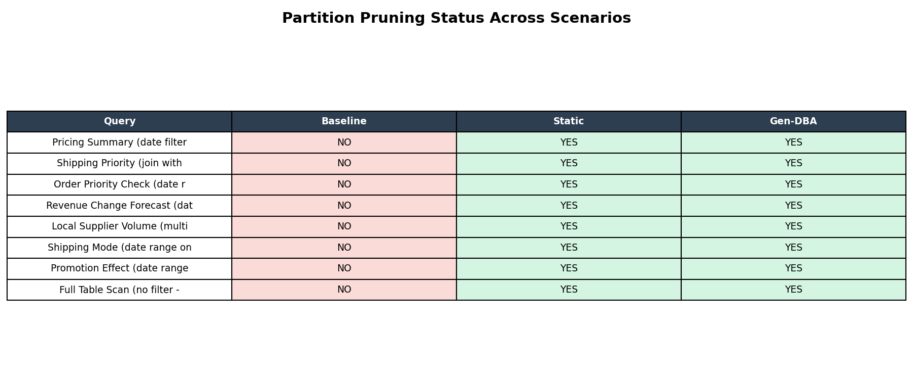

# Gen-DBA: AI-Driven Data Partitioning Agent for Oracle 19c

## 1. Project Overview
An intelligent database administration agent that uses **LangGraph** and **OpenAI GPT-4o-mini** to analyze Oracle workload patterns and automatically recommend optimal data partitioning strategies. Built as a capstone project for the **Distributed Database Systems** course at VNUHCM - University of Information Technology.

Gen-DBA acts as a "Virtual DBA", replacing manual heuristic partitioning with a data-driven approach by directly inspecting Oracle's execution memory (`V$SQLAREA`).

## 2. Features
- **Real-time Workload Analysis:** Connects to Oracle 19c to extract the most expensive queries and their execution frequencies.
- **Agentic AI Workflow:** Utilizes a 4-node LangGraph pipeline (Perception -> Reasoning -> Validation -> Action) to make autonomous decisions.
- **Safe DDL Execution:** Includes an automated "Validation Node" to sanitize hallucinations from the LLM (e.g., removing invalid `TABLESPACE` or `STORAGE` tags) and uses `CREATE TABLE AS SELECT` (CTAS) for zero data loss.
- **Interactive Dashboard:** A Next.js frontend to monitor real-time database health, view table partition status, and review the AI's execution audit logs.
- **Automated Benchmarking:** Built-in Python scripts to run A/B testing on TPC-H datasets across Baseline, Static, and AI-Optimized scenarios.

## 3. Architecture
Gen-DBA operates on a microservices architecture bridging an AI Agent with physical database internals.

```text
                    +------------------+
                    |   Next.js (UI)    |
                    +--------+---------+
                             |
                    +--------v---------+
                    |   FastAPI (API)   |
                    +--------+---------+
                             |
                    +--------v---------+
                    |  LangGraph Agent  |
                    +--------+---------+
                             |
          +------------------+------------------+
          |          |           |               |
   +------v--+ +----v-----+ +--v--------+ +----v------+
   |Perception| |Reasoning | |Validation | |  Action   |
   +------+---+ +----+-----+ +--+--------+ +----+------+
          |          |           |               |
   +------v----------v-----------v---------------v------+
   |              Oracle Database 19c (PDB)             |
   |         V$SQL | DBA_TABLES | EXPLAIN PLAN          |
   +----------------------------------------------------+
```

**Agent Pipeline:**

1. **Perception** - Collects workload data from Oracle `V$SQLAREA` and `DBA_TABLES`
2. **Reasoning** - Sends workload summary to OpenAI for partition strategy analysis
3. **Validation** - Validates the generated DDL syntax and safety
4. **Action** - Executes DDL with backup, audit logging, and partition pruning verification
5. **Evaluation** - Verifies execution results and gathers post-change statistics

### Tech Stack

| Component | Technology |
|-----------|-----------|
| Agent Framework | LangGraph 1.1 |
| LLM | OpenAI GPT-4o-mini |
| Backend API | FastAPI + Uvicorn |
| Database | Oracle Database 19c Enterprise Edition |
| DB Driver | python-oracledb (Thin mode) |
| Configuration | Pydantic Settings + dotenv |
| Logging | Structured JSON (file + console) |
| Containerization | Docker + Docker Compose |
| Benchmark | TPC-H queries + matplotlib |

### Project Structure

```text
gen-dba/
|-- app/
|   |-- agent/
|   |   |-- nodes/          # LangGraph pipeline nodes
|   |   |   |-- perception.py
|   |   |   |-- reasoning.py
|   |   |   |-- validation.py
|   |   |   |-- action.py
|   |   |   |-- evaluation.py
|   |   |-- prompts/         # LLM prompt templates
|   |   |-- graph.py         # LangGraph workflow definition
|   |   |-- state.py         # Agent state schema
|   |-- api/
|   |   |-- routes/
|   |   |   |-- agent.py     # /api/agent/* endpoints
|   |   |   |-- partitions.py # /api/partitions/* endpoints
|   |   |   |-- metrics.py   # /api/metrics/* endpoints
|   |   |-- error_handler.py # Global exception handlers
|   |-- db/
|   |   |-- oracle_client.py # Oracle connection and query execution
|   |   |-- ddl_manager.py   # Safe DDL execution with backup
|   |   |-- audit.py         # Audit trail for DDL operations
|   |   |-- queries.py       # SQL query definitions
|   |-- config.py            # Application settings
|   |-- logger.py            # Structured JSON logger
|   |-- main.py              # FastAPI application entry point
|-- scripts/
|   |-- benchmark.py              # Benchmark runner
|   |-- benchmark_queries.py      # TPC-H query definitions
|   |-- run_all_benchmarks.py     # Full 3-scenario benchmark suite
|   |-- visualize_results.py      # Chart generation from results
|   |-- setup_db_user.py          # Oracle user setup
|   |-- test_pipeline.py          # Agent pipeline test
|-- tests/
|   |-- test_oracle_connection.py # Oracle connection unit tests
|-- docs/
|   |-- EVALUATION_REPORT.md      # Performance evaluation report
|-- benchmark_charts/             # Generated charts (PNG)
|-- Dockerfile
|-- docker-compose.yml
|-- requirements.txt
|-- .env.example
```

## 4. Installation

### Prerequisites
- **Python 3.11+** (via Anaconda recommended)
- **Oracle Database 19c** Enterprise Edition with Partitioning option
- **Docker Desktop** (optional, for containerized deployment)
- **OpenAI API Key** with access to GPT-4o-mini

### Setup Backend
```bash
# 1. Clone the repository
git clone https://github.com/adamwhite625/Gen-DBA.git
cd Gen-DBA

# 2. Create conda environment
conda create -n gendba python=3.11 -y
conda activate gendba
pip install -r requirements.txt

# 3. Initialize database user and TPC-H data
python -m scripts.setup_db_user

# 4. Start the FastAPI server
uvicorn app.main:app --reload --host 0.0.0.0 --port 8000
```

### Setup Frontend
```bash
cd frontend
npm install
npm run dev
```

### Key API Endpoints

| Method | Endpoint | Description |
|--------|----------|-------------|
| POST | `/api/agent/analyze` | Trigger workload analysis |
| POST | `/api/partitions/approve/{run_id}` | Approve partition recommendations |
| POST | `/api/agent/execute/{run_id}` | Execute approved DDL |
| GET | `/api/metrics/performance` | View top queries and table sizes |
| GET | `/api/metrics/partitions/summary` | View partition layout |
| GET | `/api/metrics/audit` | View DDL audit trail |
| GET | `/api/metrics/health/oracle` | Check Oracle connection |

## 5. Environment Variables
Copy `.env.example` to `.env` in the root directory and configure the variables:

```env
# Oracle Database Credentials
ORACLE_USER=gendba
ORACLE_PASSWORD=your_password
ORACLE_DSN=localhost:1521/orclpdb

# OpenAI API
OPENAI_API_KEY=sk-your-openai-api-key
```

## 6. Benchmark & Performance
The system includes a rigorous benchmark suite comparing Gen-DBA against a standard DBA's static partitioning strategy, evaluated using TPC-H analytical queries (Scale Factor = 0.1).

### Evaluation Highlights
- **Gen-DBA vs Static Partitioning:** The AI-generated strategy runs **10.4% faster** on average. For complex multi-join queries (e.g., Q14), it is up to **41.5% faster**.
- **I/O Reduction:** Buffer Gets (Logical I/O) dropped by over **60%** for range-scan queries due to optimal Partition Pruning.

### Benchmark Visualizations

*Gen-DBA vs Static Partitioning (Elapsed Time)*


*Partition Pruning Efficiency (Buffer Gets)*


*Partition Pruning Status across Scenarios*


To reproduce the benchmark results:
```bash
python -m scripts.run_all_benchmarks
python -m scripts.visualize_results
```
